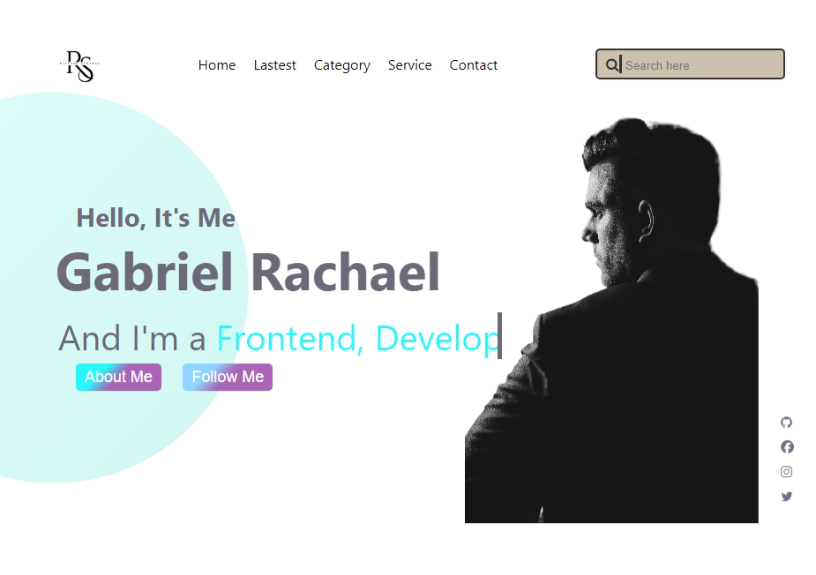

## Table of contents


- [Table of contents](#table-of-contents)
- [Overview](#overview)
  - [Screenshot](#screenshot)
  - [Links](#links)
- [My process](#my-process)
  - [Built with](#built-with)
  - [What I learned](#what-i-learned)
- [Author](#author)


## Overview

### Screenshot



### Links

- Solution URL: [https://github.com/Rachy112/Rachael-gabriel](https://your-solution-url.com)
- Live Site URL: [https://rachaelgabrielproject.netlify.app](https://your-live-site-url.com)

## My process

### Built with

- Semantic HTML5 markup
- CSS custom properties
- Flexbox
- CSS Animation
- Mobile-first workflow

### What I learned

I was able to learned more about CSS styling and a learn a little bit on how to make an animation. 
Below are the new code samples that are of great reinforcement to my knowledge.

```html
<div>HTML code I'm proud of</div>
```
```css
.proud-of-this-css {
  @keysframe
}
```

## Author
Markup:
  - Website - [Gabriel Rachael Omowumi](https://www.instagram.rachy_word1.com)
  - Frontend Mentor - [@rachy112](https://www.frontendmentor.io/profile/rachy112)
  - Twitter - [@rachyworld](https://www.twitter.com/rachy112)
